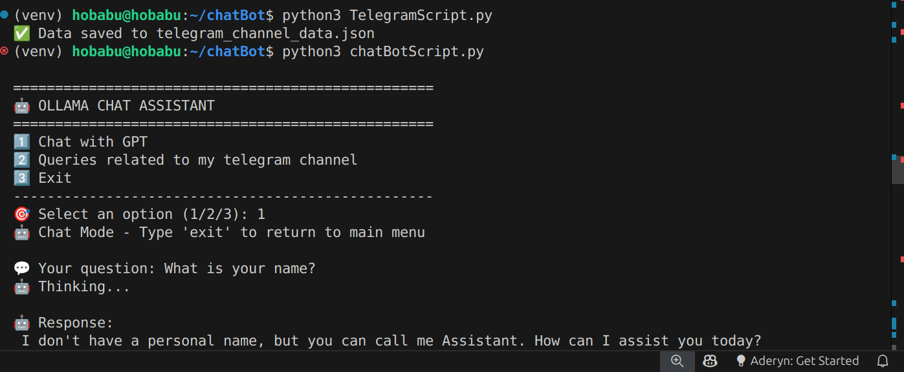
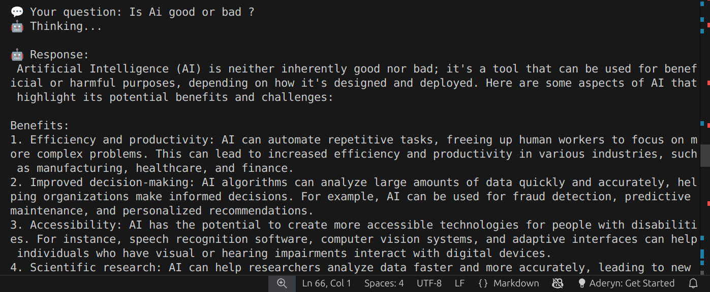
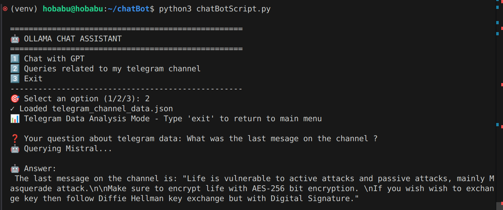

# Namaste 🙏

## Description
This is the guide to running `ollama` locally on `ubuntu` and writing python script to test it. Additionally we will be writing a python script that gets data from a public channel and save it in `json` format. 

## Command to install ollama - [Official Link](https://ollama.com/download)
```
curl -fsSL https://ollama.com/install.sh | sh
```

After installation check version with 
``` 
ollama --version 
```

### Install LlamaIndex core
```
pip install llama-index
```

### Install Ollama integration for LlamaIndex
```
pip install llama-index-llms-ollama
```
```
pip install llama-index-embeddings-ollama
```

### Pull embedding model (if not already done)
```
ollama pull nomic-embed-text
```

## Command to Pull Mistral software 
Mistral is an open-source large language model (LLM) created by Mistral AI
It’s similar to LLaMA, GPT, etc., but optimized to be lightweight and efficient.
```
ollama pull mistral 
```

## Create a virtual environment (recommended)
```
python3 -m venv venv
source venv/bin/activate
```

## Install Telethon 
Telethon is a Python library used to interact with Telegram’s API. It allows you to programmatically send messages, read messages, manage channels/groups, and more—basically, anything you can do in the Telegram app can be automated through Telethon.
```
pip install telethon
```
## Get data in json form via using TelegramScript
```
python3 TelegramScript.py
```

- A new json file `telegram_channel_data.json` will be created. It will contain the all message from that group in json format.

## Script for Interacting with ollama 
- Check `chatBotScript.py` for code. 

**Command to chat with AI assistant**
```
python3 TelegramScript.py
```

Python script is a command-line AI assistant using Ollama’s Mistral model. It has two main functionalities:

### **Chat Mode**

- Lets the user have a free-form conversation with the AI, similar to ChatGPT.

- Handles user input and displays AI responses.

### **Telegram Data Query Mode (telegram_queries)**

- Loads a JSON file containing Telegram channel data.

- Allows the user to ask questions about the data.

- Sends the JSON and user question to Mistral to get AI-generated answers based on the data.

Attaching screenshots below 
- Got data from telegram channel and stored in json file -
- Asked a question - What is your name? 


- Asked a question - Is AI good or Bad? -


- Querying details from my telegram channel -


